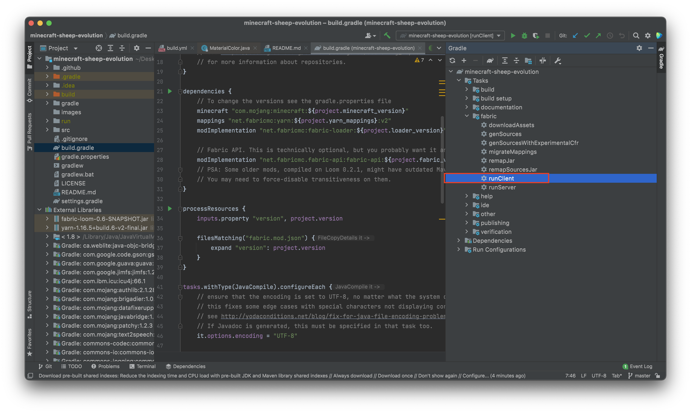

# Evolution Mod
This mod is meant to simulate the natural selection of sheep.
We modified the color, reproduction, life cycle of sheep and the hunting behavior of wolves to simulate the natural selection in Minecraft using Java. 
Please use IntelliJ Idea open it.

You can download IntelliJ Idea using this link: https://www.jetbrains.com/idea/download/#section=mac, or just search Intellij Download on Google.
(community version is enough for this project). Please choose the right operating system (i.e. I'm using macOS m1 chip, then I would choose macOS below the "Download IntelliJ IDEA" and under community, choose .dmg(Apple Silicon) and then click download).

Then, run the build.gradle file.

After that, in the upper right corner, click gradle, and in fabric dropdown menu, click runClient.
 

About Mixin:
This is a supper useful website that introduces how mixin works.
https://fabricmc.net/wiki/tutorial:mixin_introduction

Remarks:

1,Please register your mixin at eliarbogast.evolution.mod.mixins after creating it

2, use abstract class when creating a mixin.

3, when you want to use "Inject" to modify a function in the original class, if the function is a void type, you can pass in "CallbackInfo" as the parameter (ex,EscapeFromWolfMixin),
otherwise, please pass in "CallbackInfoReturnable<--RETURN TYPE-->" as a parameter (ex, AttackSheepAndBreedMixin).

Q&A:

Algo:

For this project, we want to manipulate the rate of death for sheep when it's chased by a wolf by its difference between it's skin and the surrounding color.

Therefore, I wrote the SheepLifeCycleMixin class, which has the functions

1, can detect the surrounding color for sheep 

2, calculate the difference between the color of 
sheep and the surrounding color,

3, kill the sheep based on this difference.

The difference is defined as the difference between the color of ring defined in DyeUtils in utils, as visualized below.

(more detail about it please check the code comments.)

Then, by modifying the meleeAttackGoal in wolf Class, I created the attackSheepGoal. Inside this goal, I modified the attack() function in meleeAttackGoal to kill the sheep by the difference. 
The attack() will detect if the target is a sheep, then kill the sheep by chance based on the difference between the surrounding color and color of sheep. What's more, if the wolf failed to attack the sheep more than 10 times, it will be dead
(more details see the comments of the code).

Moreover, in order to simulate the "mutate" process in the natural world, we created GrassReproduceMixin and SheepColorMixin, which let sheep reproduce little sheep after eating grass and give them 
child different color.

Inside GrassReproduceMixin, we let sheep produce little sheep after eating some grass.

Inside SheepColorMixin, we mutate the color of little sheep. 

Moreover, inside AttackSheepAndBreedMixin, we modified the attack function, and then we let wolves produce child after killing a sheep. 

Variation rate:

Inheratence:

Competition:
