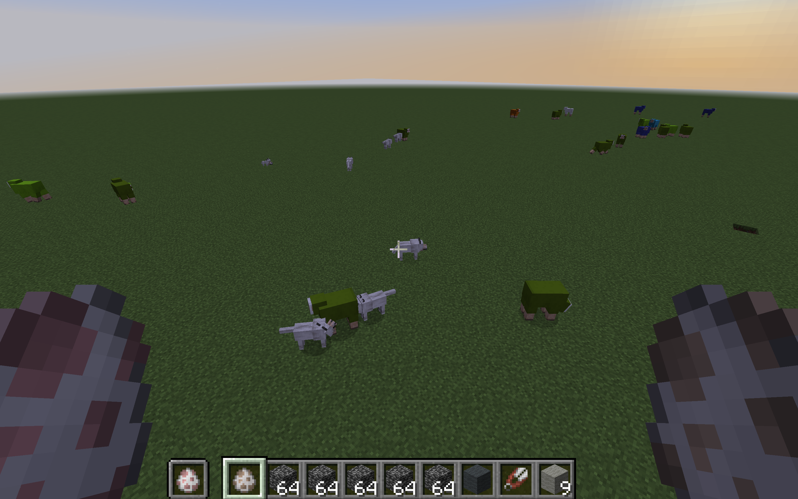
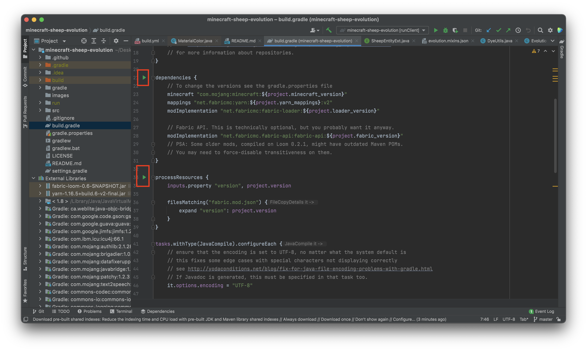
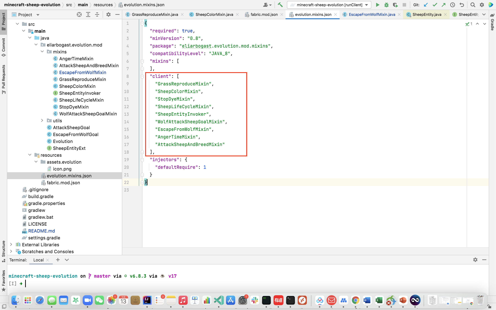
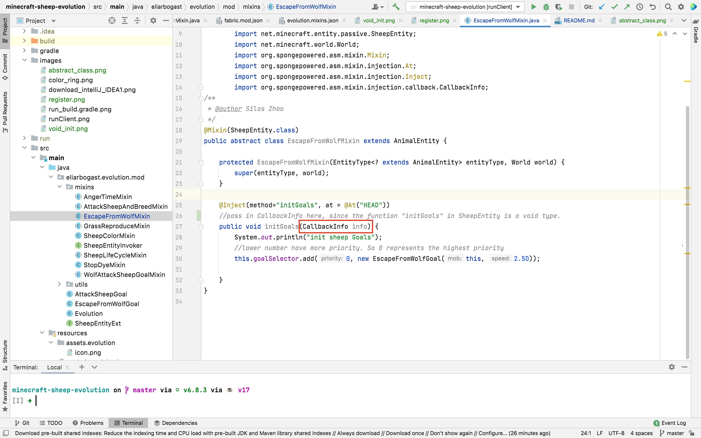
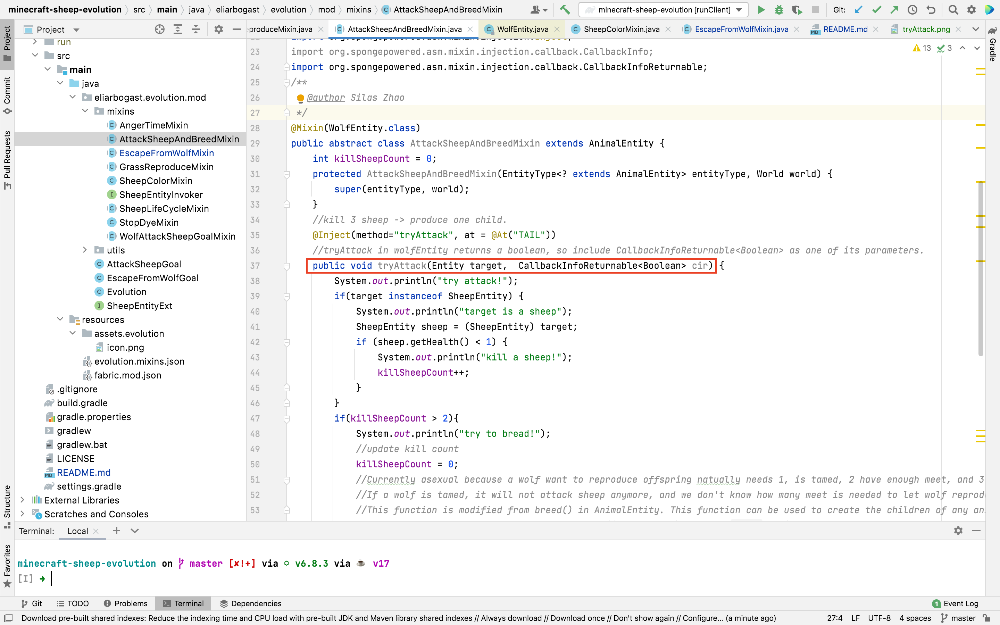
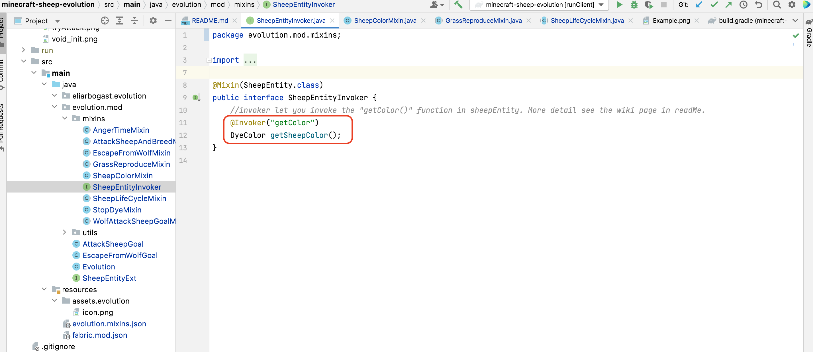
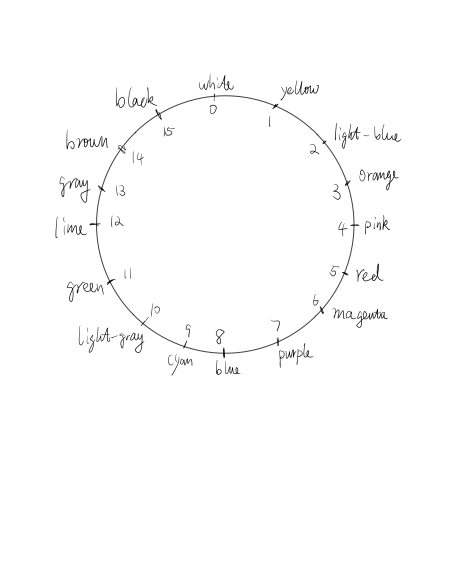

# Evolution Mod
This is a mod for the Java version of Minecraft. It enables the evolution of Minecraft sheep via natual selection using an evolutionary algorithm.
To accomplish this evolution, we modified the color, reproduction, and life cycle of sheep, as well as the hunting behavior and the reproduction of wolves.
//change to third person. //provide the tutorial link for 69 videos.

## Using the Mod
Information about how to just download and use the mod will be here
(TODO: have a guide just for people that want to use the mod, not edit it, and try to make that as easy as possible)

## Evolutionary Algorithm

For this project, we want the color of the sheep's wool to impact predation by wolves, selecting for sheep that match their environment better and demonstrating natural selection.
This mod implements all required components of evolution via natural selection, leading to actual evolutionary dynamics.

### Variation
We mutate the color of the offsprings of the sheep based on its parents. The color of small sheep is the average of its parents' color, or slightly different from it. 
(TODO: Explain how variation is achieved in the mod; should discuss both how the mutations are introduced and how the existing mixing of parent colors is used)

### Inheritance
After a sheep is grown up and eat more than 2 grasses, it will be set as "in love", which means that if two "inLove" sheep met, they can reproduce offspring.
When produce an offspring, we generate the color of small sheep based on the average color of its parents, so that the offspring is likely to have a color that similar to their parents.
(TODO: Explain how sheep now reproduce after eating enough grass and make an offspring that is likely to be similar in color

### Competition
We want to imitate the scenario that the more the skin of sheep similar to the environment, the more likely the wolves can detect the sheep, and then eat them.
Therefore, We manipulate the chance of a wolf successfully attacks a sheep based on the similarity of the sheep skin and environment. Also, in order to simulate the competition between wolves, we let wolves die if it failed to attack sheep several (still adjusting) times. 

(TODO: Explain how wolves are more likely to target and kill sheep that stand out from their surroundings, leading to differential survival of sheep based on their wool color)

## Editing the Mod
To edit the mod (and run currently), you need IntelliJ.
You can download IntelliJ Idea using this link: https://www.jetbrains.com/idea/download/#section=mac, or just search Intellij Download on Google.
(The community version is enough for this project). Please choose the right operating system (i.e. I'm using macOS m1 chip, then I would choose macOS below the "Download IntelliJ IDEA" and under community, choose .dmg(Apple Silicon) and then click download).

Then, run the build.gradle file.

After that, in the upper right corner, click gradle, and in fabric dropdown menu, click runClient.

### Tips
1. Register your mixin at evolution.mod.mixins after creating it
   (put it under client)
   

2. Use abstract class when creating a mixin. 
   

3. When you want to use `Inject` to modify a function in the original class, if the function is a void type, you can pass in `CallbackInfo` as the parameter (ex: `EscapeFromWolfMixin`)
   otherwise, please pass in `CallbackInfoReturnable<--RETURN TYPE-->` as a parameter (ex: `AttackSheepAndBreedMixin`).
   
For example,initGoals() in SheepEntity is a void type:
   

   So, when we want to use 'Inject' to modify it, besides all the required parameters in the target function (in this case, initGoals() in SheepEntity does not require any parameters), we need to pass in one more parameter, CallbackInfo.
   
   
   If we want to modify tryAttack(Entity target) in WolfEntity that returns a boolean type, you have to pass in `CallbackInfoReturnable<--RETURN TYPE-->` besides all the other required parameters in tryAttack(Entity target).
   
   

4. When you want to call some function from original class, you can use @invoker(function name). 
   For example, in SheepEntityInvoker, I want to call getColor() in SheepEntity, so I create this interface. Note that it has to be interface so that when you want to use the function(s), you can do so by simply implement it. 
   I implement SheepEntityInvoker in SheepLifeCycleMixin.
   

## Q&A

## Interfaces

### SheepEntityInvoker
We need this Invoker to call a function that inside SheepEntity. SheepEntityInvoker can invoke getColor() inside SheepEntity, and by implement the interface, SheepLifeCycleMixin can call the getColor() function in SheepEntity.
For example:

### SheepEntityExt
I created this interface because I need to call these functions I wrote.
For example, this is how I call getSurroundingColor() in SheepLifeCycleMixin. 'this' is a SheepEntity.

## Mixins and Goals
This mod uses Mixins to accomplish its changes.
If you are new to Mixins, this is a helpful place to start: https://fabricmc.net/wiki/tutorial:mixin_introduction

### SheepLifeCycleMixin
The `SheepLifeCycleMixin` class has the functions:

1. detects the color of the surrounding blocks for a given sheep

2. calculates the difference between the color of the
   sheep and the surrounding color,

3. kills the sheep based on this difference.(not using now because the wolves are killing sheep now, but you can still call it)

### DyeUtils
To quantify the difference between a sheep's wool color and the surrounding environment, we created a color ring, defined in `DyeUtils`, as shown below:

(more detail about it please check the code comments.)

### attackSheepGoal
(TODO: Expand on this to explain the goal of this change and how it works)

By modifying the meleeAttackGoal in wolf Class, I created the attackSheepGoal. Inside this goal, I modified the attack() function in meleeAttackGoal to kill the sheep by the difference between sheep and surrounding color.
The attack() will detect if the target is a sheep, then kill the sheep by chance based on the difference. What's more, if the wolf failed to attack the sheep more than 10 times, it will be dead.
(more details see the comments of the code).

### WolfAttackSheepGoalMixin
We use this mixin to add attackSheepGoal to WolfEntity by modifying its initGoals() function.

### EscapeFromWolfGoal
This goal is started when the sheep is being attacked by a wolf.

### EscapeFromWOlfMixin
We use this mixin to increase the speed of a sheep escaping from a wolf by using EscapeFromWolfGoal. Therefore, we allow sheep to escape from a wolf after being attacked.

### GrassReproduceMixin
In order to simulate the "mutate" process in the natural world, we created GrassReproduceMixin and SheepColorMixin, which let sheep reproduce little sheep after eating grass and give them
child different color.

(TODO: break the rest of this by mixin and include more discussion)
Inside GrassReproduceMixin, we let sheep produce little sheep after eating some grass by add a field called grassCount. When grassCount larger than 2, we set sheep to "inLove()". Then, if two "inLove" sheep meet, they will probably have a baby.

### SheepColorMixin
Inside SheepColorMixin, we mutate the color of little sheep. The color of little sheep is determined by the average color of its parents and add a random value. 

### AttackSheepAndBreedMixin
Moreover, inside AttackSheepAndBreedMixin, we modified the attack() function, and then we let wolves produce child after killing certain number of sheep. However, by using this way, wolf produce offspring asexually. The reason why it's hard to use
similar algorithm as we did in producing sheep is that wolf 1,need to be tamed to producing sheep, and 2, need food like meet to producing sheep. And if the wolf is tamed, it will not attack sheep anymore.

### AngerTimeMixin
This mixin is not working yet. The aim for creating this mixin is that we want the wolves be angry all the time, so that it can search and always attack sheep. 

